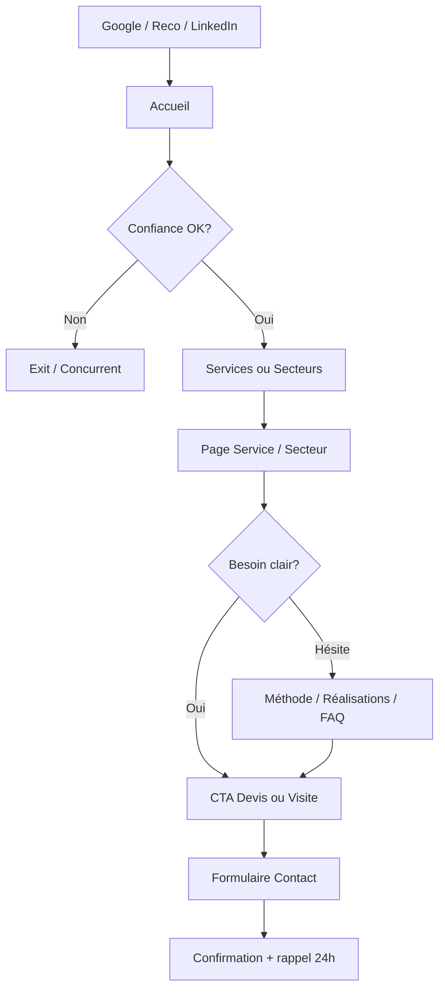
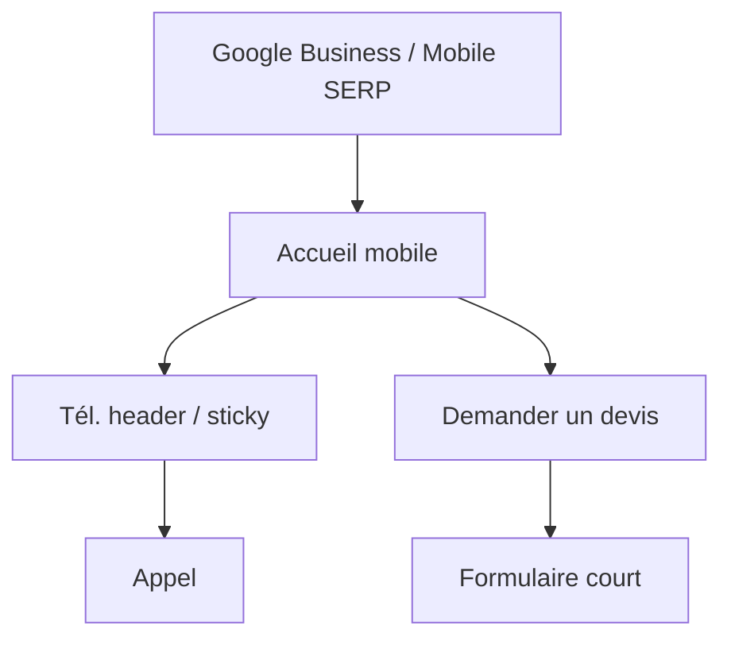
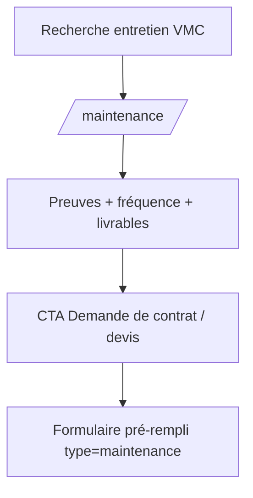
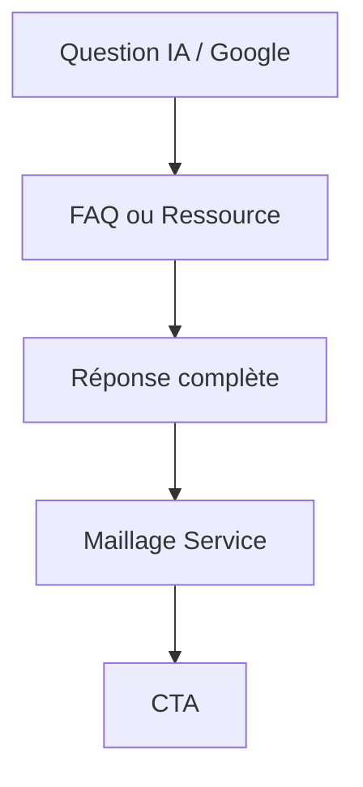

# BR TECH SÀRL — PHASE 1 · UX STRATEGY
### Site internet · Ventilation · Suisse romande
**Statut : EN ATTENTE DE VALIDATION**  
**Interdit jusqu’à validation : UI Design (Phase 2) · Développement (Phase 3)**

---

> Objectif UX : maximiser la **crédibilité perçue**, pas l’esthétique.  
> Le visiteur doit conclure en < 8 secondes : *entreprise sérieuse, propre, technique, digne d’un chantier important*.

---

# 0. ANALYSE CONCURRENTIELLE (Suisse)

## 0.1 Panorama observé

| Acteur | Type | Forces UX / Trust | Faiblesses |
|---|---|---|---|
| **Hälg Group** | Grand groupe national | Preuves institutionnelles (100 ans, chiffres, sites, références), structure claire, EEAT fort | Peu « spécialiste ventilation » ; parcours B2B large, conversion locale diluée |
| **Vuichard Groupe** | Concurrent romand proche | Ancienneté (1964), téléphone visible, services clairs, FAQ, ancrage Bussigny/Lausanne | Identité visuelle moyenne ; polyvalence CVC dilue la spécialisation ; densité textuelle élevée |
| **Ventilinstal** | Concurrent local SEO | Couverture sémantique VMC large, pages locales | Surcharge emoji/marketing, multi-métiers (clim + plomberie), crédibilité premium faible, scan difficile |
| **Aérotec21 / Saphir M** | Locaux Lausanne | Intent local, CTA devis | Contenu générique, preuves faibles, design template, EEAT limité |

## 0.2 Opportunité BR Tech (espace blanc)

Aucun concurrent romand **spécialiste ventilation** ne combine simultanément :
1. Perception premium « grand groupe suisse »  
2. Spécialisation verticale claire (pas CVC fourre-tout)  
3. Parcours conversion B2B ultra-clair (devis / visite technique)  
4. Architecture SEO/AEO/GEO digne d’une référence  
5. Preuves de process (méthode, documentation, propreté)

**Position UX à occuper :** *la référence crédible ventilation en Suisse romande* — calme institutionnel de Hälg + spécialisation locale + conversion supérieure aux TPE.

## 0.3 Principes différenciants dérivés

| Concurrent type | Ce qu’ils font | Ce que BR Tech fera mieux |
|---|---|---|
| TPE locales | Texte long, emoji, multi-services | Hiérarchie scannable, spécialiste, silence graphique |
| Groupes nationaux | Crédibilité institutionnelle | Même codes trust + CTA local + proximité Renens |
| Sites SEO | Mots-clés partout | Réponses AEO + entités + preuves EEAT |

---

# 1. OBJECTIFS PRODUIT & MÉTRIQUES

## 1.1 Objectif primaire
**Générer des demandes de devis / visites techniques qualifiées** (architectes, EG, régies, industries, collectivités, particuliers haut de gamme).

## 1.2 Objectifs secondaires
- Appels téléphoniques depuis header / sticky mobile  
- Inscription confiance (retour plus tard / recommandation)  
- Classement local + citation IA (GEO/AEO)

## 1.3 KPIs UX / CRO (Phase post-lancement)

| KPI | Cible indicative |
|---|---|
| Taux de clic CTA primaire (desktop) | ≥ 4–6 % sessions engagées |
| Taux appel mobile | ≥ 8–12 % sessions mobile |
| Scroll depth section Méthode | ≥ 55 % |
| Soumission formulaire valide | ≥ 25 % des ouvertures formulaire |
| Temps jusqu’au 1er CTA visible | < 1 s (above the fold) |
| Bounce pages services | < 45 % |

---

# 2. PERSONAS & INTENTIONS (rappel opérationnel)

## P1 — Décideur B2B (primaire) — ~60 % valeur
Chef de projet / DT régie, EG, architecte.  
**Job :** trouver un ventiliste fiable sans risque chantier.  
**Signal de confiance :** process, normes, propreté, téléphone, clarté devis.  
**CTA préféré :** *Planifier une visite technique* puis devis.

## P2 — Maître d’ouvrage / particulier haut de gamme — ~25 %
**Job :** confort, silence, qualité, finition.  
**CTA :** *Demander un devis*.

## P3 — Industrie / collectivité — ~15 %
**Job :** conformité, maintenance, interlocuteur unique.  
**CTA :** devis + maintenance.

## Intentions de recherche mappées

| Intent | Exemple | Page d’atterrissage |
|---|---|---|
| Transactionnel local | « ventilation Renens » | Accueil / Zone Renens |
| Service | « VMC double flux Lausanne » | Service Double flux |
| B2B | « ventilation entreprise générale » | Secteur EG / Accueil |
| Problème | « humidité ventilation immeuble » | FAQ / Qualité air |
| Maintenance | « entretien VMC Vaud » | Maintenance |

---

# 3. ARCHITECTURE DE L’INFORMATION

## 3.1 Navigation primaire (Header) — validée brief + Hick

```
[Logo]  Services ▾  Secteurs ▾  Réalisations  Maintenance  À propos  Contact
                                                    [Tél. visible]  [Demander un devis]
```

**Justification Hick :** 6 items nav + 2 actions persistantes. Au-delà de ~7, la latence de décision augmente.  
**Justification Fitts :** Téléphone et CTA = grandes cibles à droite (zone habituelle actions, Jakob’s Law).  
**Serial Position Effect :** Services (début) + Contact/CTA (fin) = positions mémorisables.

### Mega-menus (progressive disclosure)

**Services ▾**
- Installation
- Rénovation
- Double flux
- Simple flux / Extraction
- Dépannage
- Optimisation énergétique
- → Voir tous les services

**Secteurs ▾**
- Résidentiel haut de gamme
- Immeubles / Copropriétés
- Bureaux & administratif
- Industriel
- Collectivités
- Architectes & EG (page partenaire)

**Maintenance** = entrée directe (Von Restorff léger : item standalone = offre récurrente business).

## 3.2 Arborescence complète (v1)

```
/                                 Accueil
/services/                        Hub services
  /services/installation/
  /services/renovation/
  /services/double-flux/
  /services/extraction/
  /services/depannage/
  /services/optimisation-energetique/
/maintenance/                     Hub maintenance (+ contrats)
/secteurs/
  /secteurs/residentiel/
  /secteurs/immeubles/
  /secteurs/bureaux/
  /secteurs/industriel/
  /secteurs/collectivites/
  /secteurs/architectes-entreprises-generales/
/realisations/                    Index + filtres
  /realisations/[slug]/
/a-propos/
/processus/                       (= Notre méthode, aussi ancré accueil)
/zones/
  /zones/renens/
  /zones/lausanne/
  /zones/ouest-lausannois/
  /zones/morges/
  /zones/nyon/
  /zones/[autres si zone réelle]/
/ressources/
  /ressources/faq/
  /ressources/normes-ventilation-suisse/
  /ressources/entretien-vmc/
/contact/
/mentions-legales/
/confidentialite/
```

## 3.3 Cocon sémantique (SEO/AEO)

```
                 [/services/] ←→ [/maintenance/]
                        ↑
   [/zones/*] ←→ [ / ] ←→ [/secteurs/*]
                        ↓
              [/realisations/] ←→ [/ressources/]
                        ↓
                   [/contact/]
```

Règle : chaque page fille → hub + 1 sœur + 1 preuve + CTA.

---

# 4. OBJECTIFS PAR PAGE

| Page | Objectif utilisateur | Objectif business | Success metric |
|---|---|---|---|
| Accueil | Comprendre l’offre + croire + agir | Devis / visite / appel | CTA clicks + calls |
| Hub Services | Choisir le bon service | Deep-link service | Clics vers services |
| Page Service | Valider fit technique | Devis service | Form starts |
| Maintenance | Comprendre contrat préventif | Demande maintenance | Leads maintenance |
| Secteur | Se reconnaître | Contact contextualisé | CTA secteur |
| Réalisations | Preuve visuelle | Confiance → contact | Clics projet → contact |
| À propos | EEAT humain/entreprise | Réassurance | Time on page |
| Processus | Réduire incertitude | Qualifier le lead | Scroll + CTA |
| Zone | Confirmer proximité | Local pack + lead | Appels locaux |
| FAQ/Ressources | Répondre / AEO | Autorité + internal link | SERP/AI citations |
| Contact | Convertir | Lead qualifié | Submit rate |

---

# 5. USER FLOWS

## 5.1 Flow A — B2B « Chantier à confier » (primaire)



## 5.2 Flow B — Mobile « Besoin rapide »



## 5.3 Flow C — Maintenance récurrente



## 5.4 Flow D — AEO / FAQ → conversion



---

# 6. PARCOURS UTILISATEUR DÉTAILLÉS (JOURNEY)

## 6.1 Marc — Directeur technique régie

| Étape | Pensée | Action | Émotion | Design response |
|---|---|---|---|---|
| 1. Awareness | « Il me faut un ventiliste fiable pour un immeuble » | Google | Pressé / prudent | Title local + trust snippets |
| 2. Land | « Est-ce sérieux ? » | Scan hero 5 s | Jugement | Marque + signature + téléphone + CTA |
| 3. Trust | « Travaillent-ils avec des régies ? » | Bande confiance + secteurs | Ouverture | Logos audiences (texte, pas faux logos clients) |
| 4. Evaluate | « Comment travaillent-ils ? » | Méthode timeline | Réassurance | Process 6 étapes |
| 5. Proof | « Ont-ils déjà fait ce type de bâtiment ? » | Réalisations filtre Immeubles | Confiance | Photos réelles |
| 6. Act | « OK, visite technique » | CTA secondaire | Décision | Formulaire court, friction basse |
| 7. End | « Accusé réception clair » | Email auto | Peak-End positif | Microcopy confirmation précise |

## 6.2 Élise — Particulier haut de gamme

Land → Hero confort/qualité → Double flux → Réalisations résidentiel → Devis.  
Évite jargon ; traduit bénéfices (silence, air, finition).

---

# 7. STRUCTURE PAGE D’ACCUEIL (ordre de sections)

Ordre optimisé **Peak-End Rule** + **Goal Gradient** :

| # | Section | Rôle cognitif |
|---|---|---|
| 0 | Header sticky | Orientation + accès permanent action (Jakob) |
| 1 | Hero | Positionnement + CTA (primauté) |
| 2 | Bande de confiance | Preuve sociale / cadrage audiences |
| 3 | Pourquoi BR Tech (4 cartes) | Différenciation rapide |
| 4 | Domaines d’expertise | Orientation offre (progressive disclosure) |
| 5 | Réalisations | Preuve visuelle EEAT |
| 6 | Méthode (timeline) | Réduction incertitude |
| 7 | Chiffres | Autorité *uniquement si données réelles* |
| 8 | FAQ | AEO + objections |
| 9 | Contact | Conversion (fin = Peak-End) |
| 10 | Footer riche | SEO + légal + filet de sécurité |

### Note critique UX — Section Chiffres
**Ne jamais afficher de XX fictifs.**  
Chiffres inventés détruisent la confiance (biais de détection de mensonge).  
Tant que non fournis : remplacer la section par **« Ce que nous livrons »** (livrables : documentation, mesures, propreté, délais tenus) **OU** masquer la section.  
→ Décision à valider avec le client.

### Note critique — Checklist Hero (5 items)
Conforme brief. Compatible Miller (5 ± 2).  
Formulation recommandée (sans surpromesse) :
- Devis clair et détaillé *(plutôt que « gratuit » si non systématique — à confirmer)*  
- Intervention planifiée  
- Respect des normes SIA applicables  
- Solutions adaptées au bâtiment  
- Maintenance préventive  

> Point de validation : le brief demande « Devis gratuit » et « Intervention rapide ».  
> **Recommandation UX confiance :** ne garder ces formulations que si opérationnellement vraies. Sinon reformuler (crédibilité > marketing).

---

# 8. HIÉRARCHIE VISUELLE (basse fidélité — sans UI)

## 8.1 Priorité de lecture Hero (F-pattern + Visual Hierarchy)

```
1. Logo / Marque
2. H1 « L'air, maîtrisé. »
3. Sous-titre (1 phrase)
4. CTA primaire (Demander un devis)
5. CTA secondaire (Planifier une visite technique)
6. Checklist confiance
7. Photographie (ancrage sensoriel)
8. Téléphone header (accès permanent — PAS de lien Appeler dans le hero)
```

**Justification :** Le téléphone est déjà en header (Fitts + redondance évitée = Hick).  
Deux CTA hero max (Hick). Primaire = devis ; Secondaire = visite (B2B).

## 8.2 Poids relatif (échelle 1–10)

| Élément | Poids |
|---|---|
| H1 | 10 |
| Photo hero | 9 |
| CTA primaire | 8 |
| Téléphone header | 8 |
| CTA secondaire | 6 |
| Checklist | 5 |
| Nav links | 4 |
| Bande confiance | 5 |

---

# 9. POSITIONNEMENT DES CTA

## 9.1 Matrice CTA

| Emplacement | Primaire | Secondaire | Justification |
|---|---|---|---|
| Header | Demander un devis | Téléphone (action directe) | Accès permanent |
| Hero | Demander un devis | Planifier une visite technique | Double intent B2B/B2C |
| Fin Expertise | Demander un devis | — | Goal gradient |
| Après Réalisations | Planifier une visite | — | Preuve → action |
| Après Méthode | Demander un devis | — | Incertitude levée |
| FAQ | Contact / Devis inline | — | Objection handled |
| Contact | Envoyer la demande | — | Conversion |
| Mobile sticky | Devis \| Appeler | — | Pouce / Fitts |

## 9.2 Règle anti-fatigue
Max **1 CTA primaire visible par viewport**.  
Le sticky mobile cumule 2 actions seulement sur petit écran (exception justifiée Fitts).

---

# 10. WIREFRAMES BASSE FIDÉLITÉ

Convention : blocs, pas de couleurs, pas de styles UI.

## 10.1 Desktop — Accueil (1440)

```
┌──────────────────────────────────────────────────────────────────────────┐
│ [LOGO]  Services  Secteurs  Réalisations  Maintenance  À propos  Contact │
│                                      [ +41 .. .. .. .. ]  [ DEVIS ▉▉▉ ] │
├──────────────────────────────────────────────────────────────────────────┤
│                                                                          │
│  L'air, maîtrisé.                          ┌──────────────────────────┐ │
│                                            │                          │ │
│  Installation, rénovation et maintenance   │     PHOTO INSTALLATION   │ │
│  de systèmes de ventilation pour les       │     (plein cadre droit)  │ │
│  entreprises et bâtiments en Suisse        │                          │ │
│  romande.                                  │                          │ │
│                                            │                          │ │
│  [✓] ...  [✓] ...  [✓] ...                 └──────────────────────────┘ │
│  [✓] ...  [✓] ...                                                        │
│                                                                          │
│  [ DEMANADER UN DEVIS ]   [ Planifier une visite technique ]             │
│                                                                          │
├──────────────────────────────────────────────────────────────────────────┤
│  ★★★★★   Architectes · Régies · PME · Industries · Collectivités         │
│  Respect des normes · Installation soignée · Suivi · Maintenance         │
├──────────────────────────────────────────────────────────────────────────┤
│  Pourquoi choisir BR Tech ?                                              │
│  ┌────────────┐ ┌────────────┐ ┌────────────┐ ┌────────────┐            │
│  │ Icône      │ │ Icône      │ │ Icône      │ │ Icône      │            │
│  │ Titre      │ │ Titre      │ │ Titre      │ │ Titre      │            │
│  │ Texte      │ │ Texte      │ │ Texte      │ │ Texte      │            │
│  └────────────┘ └────────────┘ └────────────┘ └────────────┘            │
├──────────────────────────────────────────────────────────────────────────┤
│  Domaines d'expertise                                                    │
│  ┌──────────────────────┐ ┌──────────────────────┐                      │
│  │ Grande carte         │ │ Grande carte         │                      │
│  │ + CTA                │ │ + CTA                │                      │
│  └──────────────────────┘ └──────────────────────┘                      │
│  ┌──────────────────────┐ ┌──────────────────────┐                      │
│  │ ...                  │ │ ...                  │                      │
│  └──────────────────────┘ └──────────────────────┘                      │
├──────────────────────────────────────────────────────────────────────────┤
│  Nos réalisations                     [Filtres: Tous|Archi|Indus|...]   │
│  ┌───────────┐ ┌───────────┐ ┌───────────┐                              │
│  │ PHOTO XL  │ │ PHOTO XL  │ │ PHOTO XL  │                              │
│  └───────────┘ └───────────┘ └───────────┘                              │
├──────────────────────────────────────────────────────────────────────────┤
│  Notre méthode                                                           │
│  (1) Visite → (2) Analyse → (3) Offre → (4) Install → (5) MES → (6) Maint│
├──────────────────────────────────────────────────────────────────────────┤
│  Les chiffres  |  [A]  |  [B]  |  [C]  |  [D]   ※ données réelles only  │
├──────────────────────────────────────────────────────────────────────────┤
│  FAQ (accordéon)                                                         │
│  Q1 ▾                                                                    │
│  Q2 ▸                                                                    │
├──────────────────────────────────────────────────────────────────────────┤
│  Contact                                                                 │
│  ┌──────── Formulaire ────────┐  ┌──── Coordonnées + Map ────┐         │
│  │ Nom Société Tél Email      │  │ Adresse Renens            │         │
│  │ Type projet Message        │  │ Tél Email Horaires        │         │
│  │ [ Envoyer ]                │  │ [Google Map]              │         │
│  └────────────────────────────┘  └───────────────────────────┘         │
├──────────────────────────────────────────────────────────────────────────┤
│  FOOTER RICHE : Nav · Services · Zones · Légal · Contact · Social        │
└──────────────────────────────────────────────────────────────────────────┘
```

## 10.2 Laptop (1024–1280)
Même structure ; hero empile légèrement (texte 55% / image 45%) ; 4 cartes → 2×2 ; expertise 2 colonnes.

## 10.3 Tablet (768)
Nav → burger + téléphone + CTA devis toujours visibles (top bar compacte).  
Hero stack : texte puis image.  
Timeline verticale.  
Réalisations 2 colonnes.

## 10.4 Mobile (390)

```
┌─────────────────────────┐
│ [Logo]  [Tél] [Devis] ☰ │  ← téléphone = icône appel 1 tap
├─────────────────────────┤
│ L'air, maîtrisé.        │
│ Sous-titre...           │
│ ✓ ✓ ✓ (liste verticale) │
│ [ Demander un devis ]   │
│ [ Visite technique  ]   │
│ ┌─────────────────────┐ │
│ │ PHOTO               │ │
│ └─────────────────────┘ │
├─────────────────────────┤
│ Bande confiance (scroll │
│ horizontal discret)     │
├─────────────────────────┤
│ Cartes empilées 1 col   │
├─────────────────────────┤
│ Expertise empilée       │
├─────────────────────────┤
│ Réalisations 1 col XL   │
├─────────────────────────┤
│ Timeline verticale      │
├─────────────────────────┤
│ FAQ                     │
├─────────────────────────┤
│ Contact + form          │
├─────────────────────────┤
│ Footer accordéon        │
├─────────────────────────┤
│ STICKY: [Devis] [Appeler]│
└─────────────────────────┘
```

**Mobile ≠ desktop réduit :**  
- Priorité appel  
- Sticky dual CTA (Fitts / pouce zone)  
- Filtres réalisations en chips scroll horizontal  
- Footer en accordéons (progressive disclosure)

## 10.5 Wireframe page Service (template)

```
H1 service + zone
Chapô AEO (40–60 mots)
Pour qui
Problèmes résolus
Méthode courte (lien processus)
Livrables
Galerie
FAQ 3–5
CTA
Maillage (sœurs + zones + réalisations)
```

## 10.6 Wireframe Contact

```
H1 Contact
Intro 1 ligne (délai de réponse)
Split: Formulaire (gauche) / Infos+Map (droite)
Champs: Nom*, Société, Tél*, Email*, Type projet*, Localisation, Message*, Consentement nLPD*
```

---

# 11. FORMULAIRE — OPTIMISATION CRO

## Champs (friction minimale)
1. Nom*  
2. Société (optionnel mais utile B2B)  
3. Téléphone*  
4. E-mail*  
5. Type de projet* (select : Installation / Rénovation / Maintenance / Dépannage / Autre)  
6. Localisation du chantier  
7. Message*  
8. Consentement*  

**Pas de captcha visible agressif** (si besoin : honeypot + rate limit).  
**1 colonne mobile.**  
**Goal Gradient :** indicateur simple si multi-étapes — *recommandation v1 = single step* (moins d’abandon).

Microcopy succès :  
« Merci. Nous vous répondons sous 24 h ouvrées. »

---

# 12. APPLICATION DES LOIS UX (décision par décision)

| Loi | Application concrète |
|---|---|
| **Jakob’s Law** | Header classique logo gauche / nav / actions droite ; patterns formulaire standards |
| **Hick’s Law** | Nav ≤ 6 ; 2 CTA hero max ; filtres réalisations limités |
| **Fitts’s Law** | CTA et téléphone grands ; sticky mobile ; spacing pouce |
| **Miller’s Law** | Checklist 5 ; timeline 6 ; chunks FAQ |
| **Gestalt (Proximité)** | Groupes nav ; cartes pourquoi en set ; form labels liés |
| **Gestalt (Similarité)** | Tous CTA primaires même forme/place mentale |
| **Gestalt (Continuité)** | Timeline méthode lecture haut→bas |
| **Serial Position** | Marque + CTA aux extrémités header ; Contact en fin de page |
| **Von Restorff** | CTA primaire seul en solid ; Maintenance item nav distinct |
| **Goal Gradient** | Timeline numérotée ; CTA répétés après preuves |
| **Peak-End Rule** | Hero fort + Contact impeccable en fin |
| **Progressive Disclosure** | Mega-menus ; FAQ accordéon ; footer mobile accordéon |
| **White Space** | >70 % blanc (brief) = réduction charge cognitive |
| **Visual Hierarchy** | H1 dominant ; ensuite CTA ; ensuite preuves |
| **Accessibility** | Focus visibles ; contraste AA ; labels ; skip link (Phase 2/3) |

---

# 13. CONVERSION (CRO) — PLAN

## 13.1 Leviers trust (avant CTA)
1. Téléphone visible immédiat  
2. Adresse Renens visible (footer + contact + schema)  
3. Audiences nommées (pas faux logos)  
4. Processus 6 étapes  
5. Photos réelles  
6. FAQ objections  
7. Délai de réponse annoncé  

## 13.2 Leviers action
1. CTA wording précis (devis / visite) — pas « Envoyer » générique en hero  
2. Répétition CTA aux moments de pic de confiance  
3. Sticky mobile  
4. Formulaire court  
5. Type projet pré-sélectionnable via query (`?type=maintenance`)

## 13.3 Anti-patterns exclus
- Pop-ups exit-intent agressifs  
- Chatbots invasifs v1  
- Compteurs fictifs  
- « Meilleur de Suisse »  
- Lien Appeler dans le hero (redondant / brief)

---

# 14. SEO / AEO / GEO — IMPLICATIONS UX (Phase 1)

| Besoin | Implication structurelle |
|---|---|
| Local SEO | Pages `/zones/*` + NAP cohérent + embed map contact |
| AEO | FAQ naturelles + réponses directes en chapô |
| GEO | Entités répétées : BR Tech Sàrl, Renens, ventilation, Suisse romande |
| EEAT | À propos, méthode, réalisations, auteurs/organisation |
| Schema | Prévu Phase 3 mais contenu préparé : LocalBusiness, Service, FAQ, Breadcrumb |
| Internal linking | CTAs textuels contextuels, pas seulement boutons |

H1 Accueil recommandé (unique) : **L'air, maîtrisé.**  
Support SEO title (onglet) : `BR Tech Sàrl | Ventilation Suisse romande — Renens (VD)`  
(Le H1 reste brand ; le title porte la requête — pattern premium + SEO.)

---

# 15. ACCESSIBILITÉ — EXIGENCES UX (contrat Phase 1)

- Ordre de focus logique header → hero → contenu  
- Skip to content  
- CTA contrastés  
- Checklist non uniquement colorielle (✓ + texte)  
- Accordéons FAQ clavier  
- Map avec alternative texte adresse  
- Formulaires : erreurs textuelles liées aux champs  

Détail composants → Phase 2 Design System.

---

# 16. CONTENU MANQUANT À OBTENIR (bloqueurs crédibilité)

| Élément | Impact | Statut |
|---|---|---|
| Téléphone réel | Header / CRO | **Requis** |
| E-mail | Contact | **Requis** |
| Horaires | Contact | Requis |
| Chiffres réels | Section chiffres | Requis ou section retirée |
| Photos chantier réelles | Hero + réalisations | **Critique** |
| Confirmation « devis gratuit » | Hero checklist | À valider légalement/ops |
| Zone d’intervention exacte | Pages zones | Requis |
| Références clients autorisées | Trust | Souhaité |

Sans téléphone + photos réelles, la crédibilité « décennies d’existence » ne tiendra pas.

---

# 17. WIREFLOW GLOBAL (synthèse)

```
Entrées: Google · GBP · Direct · LinkedIn · IA answers
    ↓
Accueil (Trust + CTA)
    ↓
Services / Secteurs / Maintenance / Réalisations / FAQ
    ↓
Contact (form)  OR  Téléphone (header/sticky)
    ↓
Confirmation + process humain 24h
```

---

# 18. DÉCISIONS UX À VALIDER (checklist client)

Merci de valider **chaque point** avant Phase 2 :

### Navigation & CTA
- [ ] Nav : Services · Secteurs · Réalisations · Maintenance · À propos · Contact  
- [ ] CTA primaire unique wording : **Demander un devis**  
- [ ] CTA secondaire hero : **Planifier une visite technique**  
- [ ] Pas de lien « Appeler » dans le hero (téléphone header seulement)  
- [ ] Sticky mobile : Devis + Appeler  

### Hero
- [ ] H1 : **L'air, maîtrisé.**  
- [ ] Sous-titre tel que brief  
- [ ] Checklist 5 items — **valider formulations exactes** (surtout « Devis gratuit » / « Intervention rapide »)  

### Sections accueil
- [ ] Ordre des 9 blocs content (hero → trust → pourquoi → expertise → réalisations → méthode → chiffres → FAQ → contact)  
- [ ] Section Chiffres : **A)** données réelles fournies **ou B)** remplacer **ou C)** supprimer  

### IA / SEO
- [ ] Arborescence v1 (services, secteurs, zones, ressources)  
- [ ] Pages zones limitées aux territoires réellement couverts  

### Contenu ops
- [ ] Fourniture téléphone / e-mail / horaires  
- [ ] Engagement délai de réponse (ex. 24 h ouvrées)  

---

# 19. LIVRABLES PHASE 1 — STATUT

| Livrable | Statut |
|---|---|
| Analyse concurrentielle | ✅ |
| Architecture de l’information | ✅ |
| User flows | ✅ |
| Parcours utilisateurs | ✅ |
| Objectifs par page | ✅ |
| Wireframes basse fidélité (Desktop/Laptop/Tablet/Mobile) | ✅ |
| Hiérarchie visuelle | ✅ |
| Positionnement CTA | ✅ |
| Justifications lois UX | ✅ |
| Optimisation conversion | ✅ |
| Implications SEO/AEO/GEO | ✅ |

| Phase suivante | Statut |
|---|---|
| Phase 2 — UI Design + Design System | 🔒 Bloquée — en attente validation |
| Phase 3 — Développement Next.js | 🔒 Bloquée — après Phase 2 |

---

# 20. PROCHAINE ÉTAPE

**Répondre « Phase 1 validée »** (avec éventuels ajustements sur la checklist §18).  

Ensuite seulement : Phase 2 — Design System complet + maquettes Desktop / Laptop / Tablet / Mobile.

---

*Document Phase 1 — BR Tech Sàrl — UX Strategy*  
*Référentiel : NN/g · CRO B2B · SEO local CH · WCAG 2.2 AA (contrat) · Brand Book v1.0*
